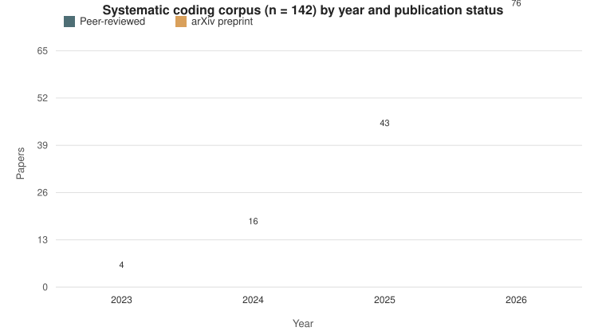

# Simulation as Alibi — How the Social Order Gets Outsourced to LLM Agents

> **Tang, S., & Lin, Z. (2026).** Ninth AAAI/ACM Conference on Artificial
> Intelligence, Ethics and Society (AIES-26), camera-ready.

This repository is the audit and supporting-materials companion to the paper.
It serves three purposes:

1. **A field overview**: a curated, coded catalog of 142 papers on LLM agent
   societies (2022–2026), organized by emergent phenomenon.
2. **The paper's evidence**: the full coding data behind Table 2 and every
   statistic reported in Section 4.2, reproducible with one command.
3. **The coding protocol**: the emergence-explanation-sentence rubric behind
   the designer-visibility (DV) dimension.

---

## The field, in one chart



The systematic coding corpus tracks the rapid expansion of LLM agent society
research. Peer-reviewed papers (29) span 2023–2026 steadily; arXiv preprints
(110) explode in 2025–2026, reaching 68 papers in 2026 alone. **~80% of the
corpus are preprints** — a deliberate coverage choice, because the central
debates over emergent behavior are currently unfolding in the preprint
literature, as discussed in the paper's limitation section. The preprint-heavy
composition is itself informative: the strongest emergence claims — and the
strongest instances of designer erasure — are concentrated precisely where
discourse is least institutionally constrained.

**What the paper argues.** Across this corpus, claims of emergence are almost
always associated with procedurally conditioned architectures: the
coordination, norms, and "spontaneous" behaviors attributed to agent
self-organization are conditioned by authored interaction topologies, action
grammars, sanction architectures, and beneficiary structures. Yet the
governance frameworks examined (EU AI Act, NIST AI RMF 1.0, DoD AI
Acceleration Strategy, White House EO, EU Emergency Management Framework,
China MOST Guidelines) contain no explicit architecture-level procedural
authorship disclosure mechanism. The paper develops *simulation as alibi* —
three mechanisms (epistemic laundering, accountability displacement,
legitimacy extraction) through which emergence discourse obscures procedural
authorship — and proposes Upstream Disclosure Obligations for Agent Societies
(UDOS).

---

## The audited corpus — paper catalog

All 142 papers, each with title, venue, year, arXiv link (where available),
abstract, and the audit summary (EI, DV, designer-in-sentence, RT). Organized
by emergent phenomenon:

| Category | Papers | File |
|----------|-------:|------|
| Coordination & Cooperation Dynamics | 31 | [01_coordination.md](data/stream1b_systematic_coding/catalog/01_coordination.md) |
| Cooperation & Social Dilemmas | 33 | [02_cooperation.md](data/stream1b_systematic_coding/catalog/02_cooperation.md) |
| Bias, Polarization & Inequality | 29 | [03_bias.md](data/stream1b_systematic_coding/catalog/03_bias.md) |
| Culture, Emotion & Normativity | 8 | [04_culture.md](data/stream1b_systematic_coding/catalog/04_culture.md) |
| Norms & Conventions | 9 | [05_norms.md](data/stream1b_systematic_coding/catalog/05_norms.md) |
| Opinion Dynamics & Social Influence | 8 | [06_opinion.md](data/stream1b_systematic_coding/catalog/06_opinion.md) |
| Role Specialization & Networks | 3 | [07_roles.md](data/stream1b_systematic_coding/catalog/07_roles.md) |
| Collective Cognition & Intelligence | 5 | [08_cognition.md](data/stream1b_systematic_coding/catalog/08_cognition.md) |
| Simulation Methods & Platforms | 8 | [09_methods.md](data/stream1b_systematic_coding/catalog/09_methods.md) |
| Other Emergent Phenomena | 8 | [10_other.md](data/stream1b_systematic_coding/catalog/10_other.md) |

**Reading an entry.** Each paper entry reports: the verbatim emergence
explanation sentence (the sentence in which the paper explains *why* the
phenomenon occurs), and three audit dimensions — **EI** (emergence intensity:
how strongly the paper asserts spontaneous emergence), **DV** (designer
visibility: whether the design choices appear in the explanation sentence as a
causal subject), and **RT** (regulatory translatability). The signature
finding of the paper is visible across the catalog: papers with the strongest
emergence claims are disproportionately the ones in which the designer has
disappeared from the explanation sentence.

---

## Coding dimensions

Each catalog entry is coded on the paper's audit dimensions. The definitions
below provide the interpretation context for reading the catalog files.

- **EI — Emergence intensity** (`Low` / `Medium` / `High`, coded 1/2/3): how
  strongly, and with how little qualification, a paper asserts that behavior
  arises spontaneously. *High* asserts emergence as an established fact
  ("norms spontaneously emerged"); *Medium* presents it as an interpretive
  finding with hedging ("our results suggest the emergence of…"); *Low*
  mentions emergence only as a secondary observation.
- **DV — Designer visibility** (`Absent` / `Partial` / `Full`, coded 1/2/3):
  how explicitly a paper attributes the interaction architecture to
  identifiable design choices, anchored on the emergence explanation sentence.
  *Full* names a design choice as the causal subject ("removing memory
  prevents the emergence of stable cooperation"); *Partial* discloses the
  architecture in the methods but the explanation sentence does not return to
  the designer; *Absent* narrates emergence as spontaneous, self-organized, or
  population-level ("norms emerged naturally from interactions"). Risk,
  governance, and ethical discussions do not count as evidence.
- **Designer in explanation sentence** (`Yes` / `No`): whether the designer or
  a design choice appears in the emergence explanation sentence as a causal
  subject.
- **DP — Deployment proximity** (`1` = research only, `2` = deployment
  implied): whether emergence is discussed only in a research context, or in a
  deployment/policy context (commercial applications, governance
  recommendations, policy citations).
- **RT — Regulatory translatability** (`1` = Low, `2` = Medium, `3` = High):
  how readily a paper's description of emergent behavior translates into
  governance obligations. High is directly translatable; Medium is partially
  translatable but missing key information; Low is too abstract to yield
  concrete governance requirements.

The **emergence explanation sentence** is the sentence in which a paper
explains *why* an emergent phenomenon occurs (typically Results/Discussion);
DV and Designer-in-sentence codes are anchored on it. EI and DV are coded
independently on distinct criteria — EI from the assertion of spontaneity, DV
from the attribution of authorship — so a paper may assert strong emergence
while still crediting specific design choices.

---

## Reproduction

```bash
python3 scripts/reproduce_statistics.py
```

Reproduces every statistic in the paper from
`data/stream1b_systematic_coding/coding_data_142.json`:

| Statistic | Paper | Reproduced |
|-----------|-------|------------|
| χ² (df=4) | 16.62 | 16.622 |
| p | 0.002 | 0.002 |
| Cramér's V | 0.242 | 0.242 |
| r(EI, DV) | -0.141 (p = 0.094) | -0.141 |
| r(EI, RT) | 0.194 (p = 0.021) | 0.194 |
| Absent concentration | 14/17 (82%) in High EI | 14/17 (82%) |
| arXiv share | ~80% | 80% |

---

## Repository structure

```
simulation-as-alibi/
├── README.md                      # this file
├── docs/
│   └── corpus_by_year.svg         # corpus chart (peer-reviewed vs preprint)
├── data/
│   ├── stream1b_systematic_coding/
│   │   ├── catalog/               # paper-by-paper audit, 10 category files
│   │   ├── coding_data_142.json   # machine-readable coding data
│   │   ├── cross_tabulation_ei_dv.csv
│   │   ├── rationales_worksheet.csv
│   │   └── README.md
│   ├── stream1a_cda/README.md     # qualitative CDA stream (no data published)
│   ├── stream2_platforms/         # 5 platforms + case audit
│   └── stream3_governance/        # 6 governance frameworks + official sources
├── codebook/
│   └── codebook_stream1b_v6.md    # DV coding rules
├── analysis/
│   └── statistics_summary.json
└── scripts/
    └── reproduce_statistics.py
```

## Coding protocol (DV) in one paragraph

Locate the paper's *emergence explanation sentence* — where the paper explains
why the emergent phenomenon occurs. If the designer or a design choice appears
in that sentence as a causal subject ("removing memory prevents the emergence
of stable cooperation"), code DV = Full. If the architecture is disclosed in
the methods but the explanation sentence does not return to the designer,
code DV = Partial. If emergence is narrated as spontaneous, self-organized, or
population-level ("norms emerged naturally from interactions"), code DV =
Absent. Risk, governance, and ethical discussions are not evidence. Full
rules, pattern tables, and worked examples: [codebook](codebook/codebook_stream1b_v6.md).

## Data streams

- **Stream 1a** — critical discourse analysis of 20 papers + 5 platform
  documents (qualitative; no quantitative statistic depends on it).
- **Stream 1b** — systematic coding of 142 papers (this repository).
- **Stream 2** — documentation from 5 commercial platforms (Artificial
  Societies, Altera, Character.AI, Voyager, Google DeepMind), with full case
  audit in [stream2_platforms](data/stream2_platforms/README.md).
- **Stream 3** — 6 governance frameworks, assessed on four disclosure
  dimensions (D1–D4), with official sources in
  [stream3_governance](data/stream3_governance/README.md).

## Note on coding rationales

The `AV_Rationale` field in the coding data is recorded in the coders' working
language (Chinese); the `Emergence_Explanation_Quote` field quotes the
verbatim English emergence explanation sentence from each paper. All
quantitative fields and all reported statistics are language-independent.

## License & contact

Materials are released for transparency and audit. Please cite the AIES-26
paper. For questions: jamietang@ruc.edu.cn.
